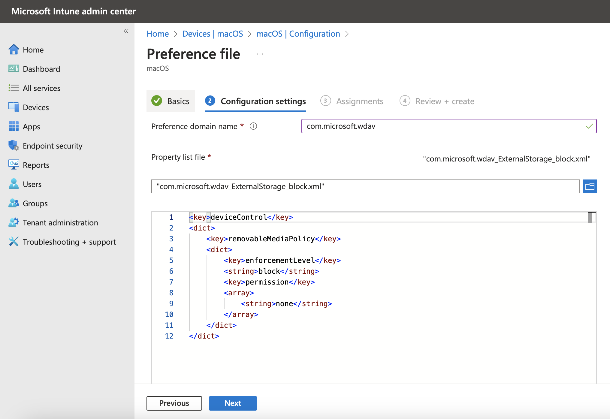
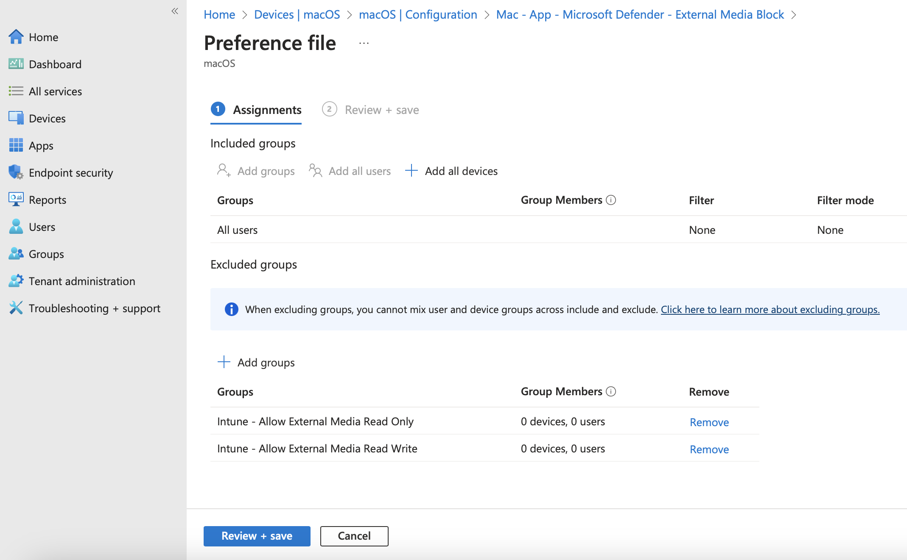
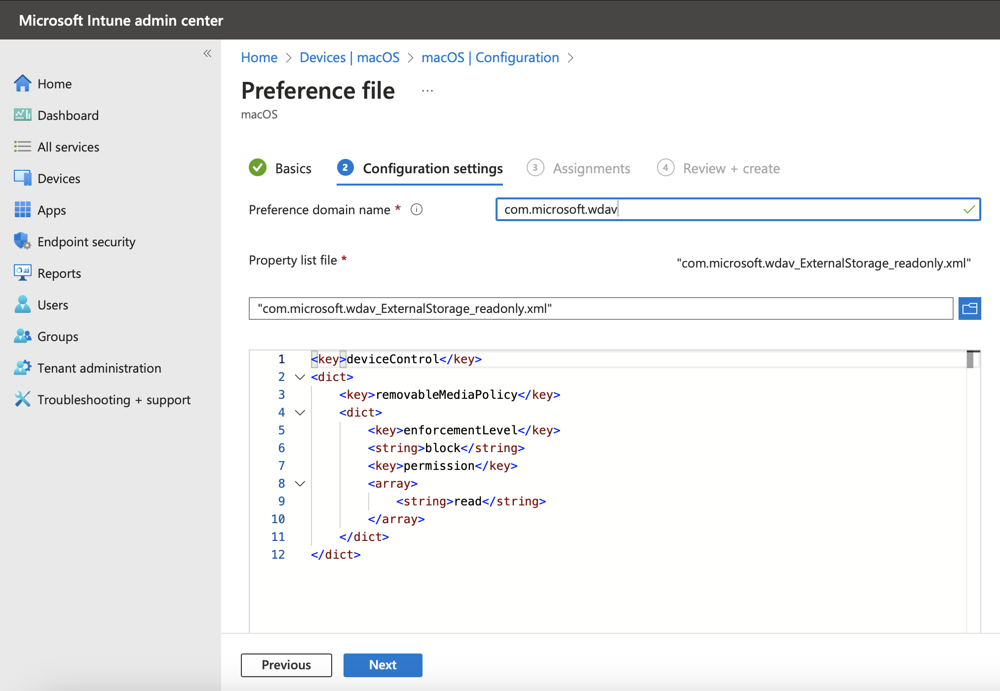
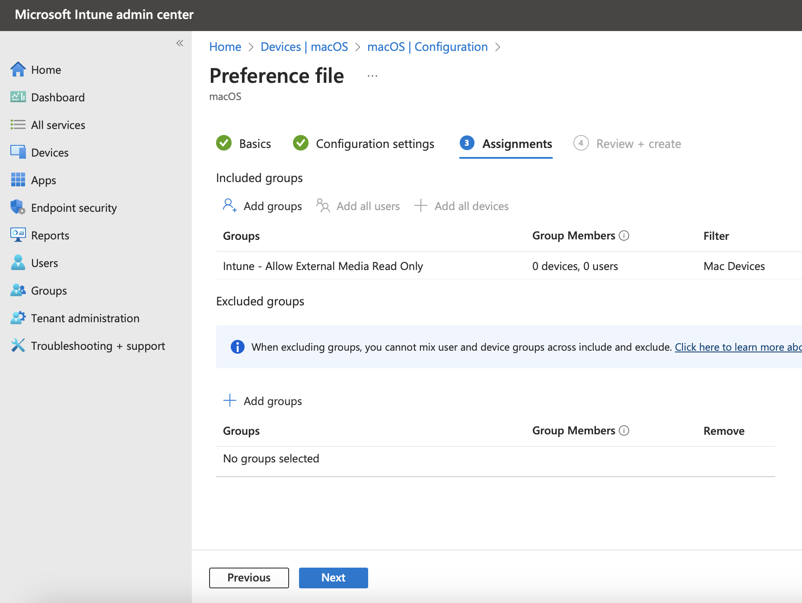

# Microsoft Defender Configuration

This is a set of Preference Files configuration for Microsoft Defender.

The Preference domain name should be: `com.microsoft.wdav`

Each one provides blocking of external media, or different access to the media, via Microsoft Defender config.  

If you want the default behavior to be block. Then apply only that configuration to all machines.  

Alternatively, create two Entra ID groups, one for read access and another for read & write access. Then create two more configuration profiles and scope deployment to these two new groups. You then also need to set both those groups as exclude on the original blocking policy.  

Then you can simply add users to either of the groups to allow access to external media as required.  

**Defender Block Policy:**  
  

**Defender Block Policy Scoped Groups:**  
  
  
**Defender Read Only Policy:**  

  
**Defender Read Policy Scoped Groups:**  
  
  
The Read+Write policy would look similar to the read only policy, just scoped to the other new group.  
